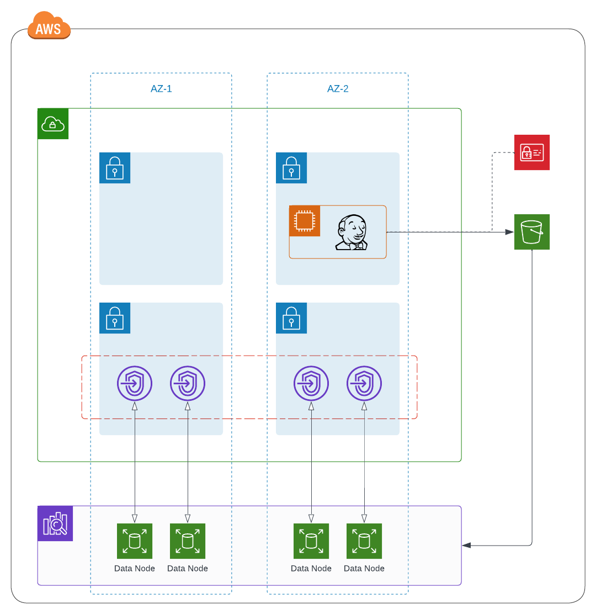

# OpenSearch with Manual Snapshots

This module expands on the generic OpenSearch module offered in this registry by supporting the manual snapshot capability. Moving data from one snapshot to another, or recovering a cluster, can be simplified with a manual snapshot procedure. Snapshots created manually are stored in an S3 bucket that consumers create within this module. In addition to the standard services provisioned in the generic OpenSearch module, this module produces an S3 bucket and the necessary roles and policies to support manual snapshot management within context of an NCI AWS environment.

For more information, please see AWS' documentation on [creating index snapshots in Amazon OpenSearch Service](https://docs.aws.amazon.com/opensearch-service/latest/developerguide/managedomains-snapshots.html).

todo:
- variable descriptions
- cloudwatch logs --> sumologic

## Table of Contents

1. [Module Configuration Insight](https://github.com/CBIIT/CTOS-DevOps-Innersource/tree/opensearch-manual-snapshot/terraform/modules/opensearch-manual-snapshot#module-configuration-insight)
2. [Reference Architecture](https://github.com/CBIIT/CTOS-DevOps-Innersource/tree/main/terraform/modules/opensearch-manual-snapshot#reference-architecture)
3. [Resources](https://github.com/CBIIT/CTOS-DevOps-Innersource/tree/main/terraform/modules/opensearch-manual-snapshot#resources)
4. [Inputs](https://github.com/CBIIT/CTOS-DevOps-Innersource/tree/main/terraform/modules/opensearch-manual-snapshot#inputs)
5. [Outputs](https://github.com/CBIIT/CTOS-DevOps-Innersource/tree/main/terraform/modules/opensearch-manual-snapshot#outputs)

## Module Configuration Insight

**Network Notes** : 
> - Cluster is deployed with VPC support for an extra layer of security.
> - Can be deployed into a single or multiple availability zones (2 zones), depending on configuration variables passed to the module.
> - For each data node within each availability zone, a VPC endpoint is generated and placed within a private subnet dedicated to database instances. 

**Security Notes** :
> - Each VPC endpoint provisioned through the module is wrapped in a security group to control network accessibility of the cluster. The security group allows traffic from within the VPC that the cluster is deployed into.
> - Data stored within the cluster is encrypted at rest with the AWS OpenSearch KMS mechanism.
> - Data in transit between the cluster nodes is encrypted in transit.

**Storage Notes** :
> - It is recommended that an OpenSearch instance type that supports Elastic Block Storage (EBS) instance storage (avoid r6gd, r3, and i3 instance types).
> - Sizing for storage is uniform across all data nodes. Please see AWS' documentation around best practices for [sizing domains](https://docs.aws.amazon.com/opensearch-service/latest/developerguide/sizing-domains.html).
> - The module does not allow consumers to configure master nodes due to the number of available availability zones within the NCI network topology (requires 3 or more availability zones).

**Snapshot Notes** :
> - By default, AWS captures a daily snapshot of managed OpenSearch clusters deployed within a VPC. Consider setting the hour in which the snapshot occurs.
> - Consumers can elect to manually manage snapshots. Manual snapshots are imported or exported on demand, and leverage a S3 bucket deployed in the account (which this module provisions on your behalf).
> - Manual snapshot configurations do not negate the daily automated snapshot activity.

## Reference Architecture
The reference architecture below depicts a multi-az deployment of an OpenSearch cluster that is using an EBS-enabled instance type. The cluster is configured with two data nodes per instance, which equates to a total of four data nodes and four VPC endpoints across the region. Lastly, this reference architecture reflects a configuration that enables manual snapshot activity. Snapshots are stored in AWS S3, and are managed by executables on the Jenkins host instance.

<!-- BEGIN_TF_DOCS -->
## Resources

| Name | Type |
|------|------|
| [aws_cloudwatch_log_group.opensearch](https://registry.terraform.io/providers/hashicorp/aws/latest/docs/resources/cloudwatch_log_group) | resource |
| [aws_cloudwatch_log_resource_policy.opensearch](https://registry.terraform.io/providers/hashicorp/aws/latest/docs/resources/cloudwatch_log_resource_policy) | resource |
| [aws_iam_policy.jenkins_snapshot](https://registry.terraform.io/providers/hashicorp/aws/latest/docs/resources/iam_policy) | resource |
| [aws_iam_policy.os_snapshot](https://registry.terraform.io/providers/hashicorp/aws/latest/docs/resources/iam_policy) | resource |
| [aws_iam_role.os_snapshot](https://registry.terraform.io/providers/hashicorp/aws/latest/docs/resources/iam_role) | resource |
| [aws_iam_role_policy_attachment.jenkins_snapshot](https://registry.terraform.io/providers/hashicorp/aws/latest/docs/resources/iam_role_policy_attachment) | resource |
| [aws_iam_role_policy_attachment.os_snapshot](https://registry.terraform.io/providers/hashicorp/aws/latest/docs/resources/iam_role_policy_attachment) | resource |
| [aws_opensearch_domain.os](https://registry.terraform.io/providers/hashicorp/aws/latest/docs/resources/opensearch_domain) | resource |
| [aws_s3_bucket.opensearch_snapshot](https://registry.terraform.io/providers/hashicorp/aws/latest/docs/resources/s3_bucket) | resource |
| [aws_security_group.opensearch](https://registry.terraform.io/providers/hashicorp/aws/latest/docs/resources/security_group) | resource |
| [aws_security_group_rule.opensearch_inbound_https](https://registry.terraform.io/providers/hashicorp/aws/latest/docs/resources/security_group_rule) | resource |

## Inputs

| Name | Description | Type | Default | Required |
|------|-------------|------|---------|:--------:|
|  [app](#input\_app) | n/a | `string` | n/a | yes |
|  [data\_node\_count](#input\_data\_node\_count) | n/a | `number` | n/a | yes |
|  [ebs\_enabled](#input\_ebs\_enabled) | n/a | `bool` | n/a | yes |
|  [ebs\_volume\_size](#input\_ebs\_volume\_size) | n/a | `number` | n/a | yes |
|  [engine\_version](#input\_engine\_version) | n/a | `string` | n/a | yes |
|  [iam\_prefix](#input\_iam\_prefix) | n/a | `string` | `"power-user"` | no |
|  [instance\_type](#input\_instance\_type) | n/a | `string` | n/a | yes |
|  [jenkins\_host\_id](#input\_jenkins\_host\_id) | n/a | `string` | n/a | yes |
|  [jenkins\_profile\_role\_name](#input\_jenkins\_profile\_role\_name) | The name of the role associated with the instance profile for the EC2 that is the Jenkins host | `string` | n/a | yes |
|  [log\_retention](#input\_log\_retention) | The number of days to save OpenSearch logs sent to CloudWatch | `number` | n/a | yes |
|  [log\_type](#input\_log\_type) | The type of OpenSearch logs to forward to CloudWatch. Options include 'INDEX\_SLOW\_LOGS, 'SEARCH\_SLOW\_LOGS', 'ES\_APPLICATION\_LOGS', and 'AUDIT\_LOGS' | `string` | `"INDEX_SLOW_LOGS"` | no |
|  [multi-az](#input\_multi-az) | n/a | `bool` | n/a | yes |
|  [snapshot\_hour](#input\_snapshot\_hour) | The hour in which OpenSearch will perform automated snapshot operations | `number` | `23` | no |
|  [subnet\_ids](#input\_subnet\_ids) | The subnets which OpenSearch will be deployed to | `set(string)` | n/a | yes |
|  [tier](#input\_tier) | n/a | `string` | n/a | yes |
|  [vpc\_id](#input\_vpc\_id) | n/a | `string` | n/a | yes |

## Outputs

| Name | Description |
|------|-------------|
|  [jenkins\_host](#output\_jenkins\_host) | n/a |
<!-- END_TF_DOCS -->