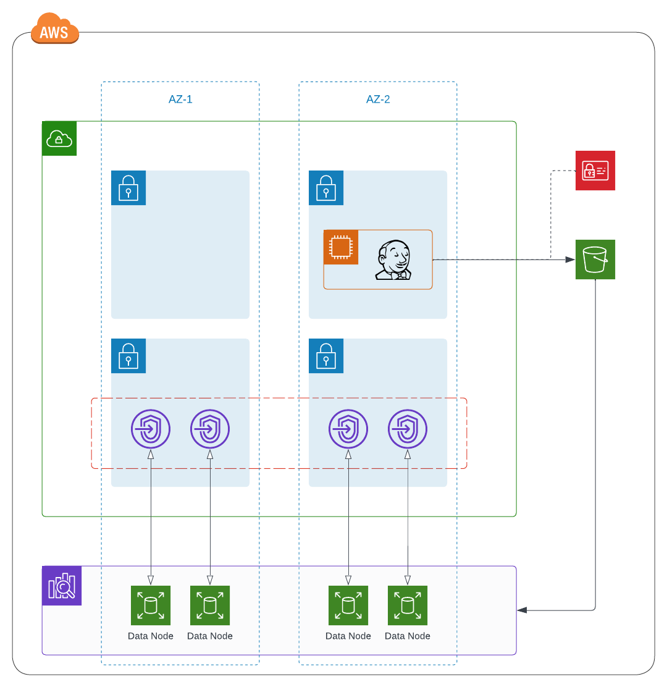

# OpenSearch with Manual Snapshots

todo:
- Table of Contents
- General Description
- variable descriptions
- remove ability to opt-out of encryption (hard default)
- cloudwatch logs --> sumologic
... add description for what this module provides.

table of contents:

## Reference Architecture

**Network** : 
- Cluster is deployed with VPC support for an extra layer of security.
- Can be deployed into a single or multiple availability zones (2 zones), depending on configuration variables passed to the module.
- For each data node within each availability zone, a VPC endpoint is generated and placed within a private subnet dedicated to database instances. 

**Security**
- Each VPC endpoint provisioned through the module is wrapped in a security group to control network accessibility of the cluster.
- Data stored within the cluster is encrypted at rest with the AWS OpenSearch KMS mechanism.
- Data in transit between the cluster nodes is encrypted in transit.

**Storage & Data Nodes**
- It is recommended that an OpenSearch instance type that supports Elastic Block Storage (EBS) instance storage (avoid r6gd, r3, and i3 instance types).
- Sizing for storage is uniform across all data nodes. Please see AWS' documentation around best practices for [sizing domains](https://docs.aws.amazon.com/opensearch-service/latest/developerguide/sizing-domains.html).
- The module does not allow consumers to configure master nodes due to the number of available availability zones within the NCI network topology (requires 3 or more availability zones).

**Snapshots**
- By default, AWS captures a daily snapshot of managed OpenSearch clusters deployed within a VPC. Consider setting the hour in which the snapshot occurs.
- Consumers can elect to manually manage snapshots. Manual snapshots are imported or exported on demand, and leverage a S3 bucket deployed in the account (which this module provisions on your behalf).
- Manual snapshot configurations do not negate the daily automated snapshot activity.

<!-- BEGIN_TF_DOCS -->
## Requirements

No requirements.

## Providers

| Name | Version |
|------|---------|
|  [aws](#provider\_aws) | n/a |

## Modules

No modules.

## Resources

| Name | Type |
|------|------|
| [aws_cloudwatch_log_group.opensearch](https://registry.terraform.io/providers/hashicorp/aws/latest/docs/resources/cloudwatch_log_group) | resource |
| [aws_cloudwatch_log_resource_policy.opensearch](https://registry.terraform.io/providers/hashicorp/aws/latest/docs/resources/cloudwatch_log_resource_policy) | resource |
| [aws_iam_policy.jenkins_snapshot](https://registry.terraform.io/providers/hashicorp/aws/latest/docs/resources/iam_policy) | resource |
| [aws_iam_policy.os_snapshot](https://registry.terraform.io/providers/hashicorp/aws/latest/docs/resources/iam_policy) | resource |
| [aws_iam_role.os_snapshot](https://registry.terraform.io/providers/hashicorp/aws/latest/docs/resources/iam_role) | resource |
| [aws_iam_role_policy_attachment.jenkins_snapshot](https://registry.terraform.io/providers/hashicorp/aws/latest/docs/resources/iam_role_policy_attachment) | resource |
| [aws_iam_role_policy_attachment.os_snapshot](https://registry.terraform.io/providers/hashicorp/aws/latest/docs/resources/iam_role_policy_attachment) | resource |
| [aws_opensearch_domain.os](https://registry.terraform.io/providers/hashicorp/aws/latest/docs/resources/opensearch_domain) | resource |
| [aws_s3_bucket.opensearch_snapshot](https://registry.terraform.io/providers/hashicorp/aws/latest/docs/resources/s3_bucket) | resource |
| [aws_security_group.opensearch](https://registry.terraform.io/providers/hashicorp/aws/latest/docs/resources/security_group) | resource |
| [aws_security_group_rule.opensearch_inbound_https](https://registry.terraform.io/providers/hashicorp/aws/latest/docs/resources/security_group_rule) | resource |
| [aws_iam_policy_document.jenkins_snapshot](https://registry.terraform.io/providers/hashicorp/aws/latest/docs/data-sources/iam_policy_document) | data source |
| [aws_iam_policy_document.os_snapshot](https://registry.terraform.io/providers/hashicorp/aws/latest/docs/data-sources/iam_policy_document) | data source |
| [aws_iam_policy_document.os_sts](https://registry.terraform.io/providers/hashicorp/aws/latest/docs/data-sources/iam_policy_document) | data source |
| [aws_instance.jenkins_host](https://registry.terraform.io/providers/hashicorp/aws/latest/docs/data-sources/instance) | data source |
| [aws_vpc.vpc](https://registry.terraform.io/providers/hashicorp/aws/latest/docs/data-sources/vpc) | data source |

## Inputs

| Name | Description | Type | Default | Required |
|------|-------------|------|---------|:--------:|
|  [app](#input\_app) | n/a | `string` | n/a | yes |
|  [data\_node\_count](#input\_data\_node\_count) | n/a | `number` | n/a | yes |
|  [ebs\_enabled](#input\_ebs\_enabled) | n/a | `bool` | n/a | yes |
|  [ebs\_volume\_size](#input\_ebs\_volume\_size) | n/a | `number` | n/a | yes |
|  [encrypt\_rest](#input\_encrypt\_rest) | n/a | `bool` | n/a | yes |
|  [engine\_version](#input\_engine\_version) | n/a | `string` | n/a | yes |
|  [instance\_type](#input\_instance\_type) | n/a | `string` | n/a | yes |
|  [jenkins\_host\_id](#input\_jenkins\_host\_id) | n/a | `string` | n/a | yes |
|  [log\_retention](#input\_log\_retention) | n/a | `number` | n/a | yes |
|  [log\_type](#input\_log\_type) | n/a | `string` | n/a | yes |
|  [logs\_enabled](#input\_logs\_enabled) | n/a | `bool` | n/a | yes |
|  [multi-az](#input\_multi-az) | n/a | `bool` | n/a | yes |
|  [node\_to\_node\_encryption](#input\_node\_to\_node\_encryption) | n/a | `bool` | n/a | yes |
|  [snapshot\_hour](#input\_snapshot\_hour) | n/a | `number` | n/a | yes |
|  [subnet\_ids](#input\_subnet\_ids) | n/a | `set(string)` | n/a | yes |
|  [tier](#input\_tier) | n/a | `string` | n/a | yes |
|  [vpc\_id](#input\_vpc\_id) | n/a | `string` | n/a | yes |

## Outputs

| Name | Description |
|------|-------------|
|  [jenkins\_host](#output\_jenkins\_host) | n/a |
<!-- END_TF_DOCS -->